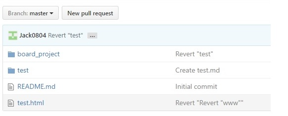

# Git 사용하기
##의문점
Spring(이클립스) GIT-플러그인을 사용하여 Github에 프로젝트파일을 올리는 것은 성공. 
하지만, Github에 올라간 프로젝트 폴더(안에 내용포함)를 어떻게 삭제하는지 방법에 의문으로 시작... 
아래 그림에 board_test 라는 폴더와 test폴더를 현재 github(web)에서 어떻게 삭제할 수있는지 계속 찾아봄...

우선 내가 조사한것으로 **`결론`**만 먼저 말씀드리면... 
GitHub에서 폴더 자체를 삭제하는(윈도우처럼) 기능은 존재하지않는다. 
**``그럼 어떻게 삭제를 해야할까 검색하면서 SourceTree 와 Git Bash 사용법을 알게되어 포스팅 시작.``**

## 1. SourceTree 사용하기
생활코딩에서 SourceTree를 사용한 Git 사용법 참고
- [생활코딩-Git사용법](https://opentutorials.org/course/1492)(SourceTree) 

이거 덕분에 Window환경에서도 Git을 자동으로 업로드할 수 있었다. 
Source트리는 버전관리 및 업로드 에 최적화 되어있는 느낌이었다. 

내가 원하는것은 
폴더(디렉토리)관리 및 Github(repository)자체를 관리하는것이었다. 

## 2. Git Bash 사용하기
Git Bash 참고 사이트(명령어 포함)

- [Git Bash사용](http://emflant.tistory.com/123)
- [Git 간편안내서](http://rogerdudler.github.io/git-guide/index.ko.html)
- [Git Hub기초사용법](http://booolean.tistory.com/443)
- [Git 명렁어 오류 stackoverflow 답변](http://stackoverflow.com/questions/10721624/github-changes-not-staged-for-commit)
- [Git 명렁어 오류 stackoverflow 답변2](http://stackoverflow.com/questions/10721624/github-changes-not-staged-for-commit)

처음에 GIT / GITHUB / PC 이 환경을 모르고 일 단 Git-Github 부터 시작한 나로썬 이번에 꽤나 삽질을 함으로써 
Git은 리눅스기반 태생이며, 명령어를 사용하여 git를 사용/관리 하는것이 태생이었다. 

## 결론
그래서 어떻게하면 GitHub에 올린 폴더를 삭제할 수 있을까??(지금생각하면 정말 간단하지만 조금전만해도 꽤나 심각했다...) 

1 SourceTree(PC) <-> GitHub 연동 상태일 때,
예를 들어  
C:\\git\\test 폴더를 SourceTree를 통하여 업로드 완료 -> GitHub 업로드 완료.  
C:\\git\\test 폴더 삭제 -> Change이벤트 발생 -> Commit -> Push -> GitHub 폴더 삭제 되어있음.  
정말 간단한 원리 였다. 내 PC의 GIT폴더와 GITHUB가 연동되어지면(SourceTree를 통하여)
git폴더에 파일을 업로드하면 커밋 이벤트가 발생하고 똑같이 삭제해도 커밋 이벤트가 발생한다. 

2 GitBash(PC) <-> GitHub 연동 상태일 때 

아래 링크에 따라 Github과 연동을 한번 해준다.
- [Git Bash사용](http://emflant.tistory.com/123)

경로 안에 폴더 삭제(커밋 이벤트 발생)
- git add .
- git commit -m "코멘트입력"
이렇게 해주면 SourceTree와 똑같은 원리로 연동 후 변화에대해서 내 pc에서의 git 경로와 github가 동기화가 이루어진다. 

Repository('repo'라 지칭)를 관리하려면 관리하고자 하는 repo와 pc에서 git동기화를 시켜주고 관리가 이루져야한다. 

이번 GIT사용방법을 통해 Git은 SourceTree보다 리눅스 관련 명령어를 더 활용할 수 있는 방법으로 앞으로 사용하고자한다.
